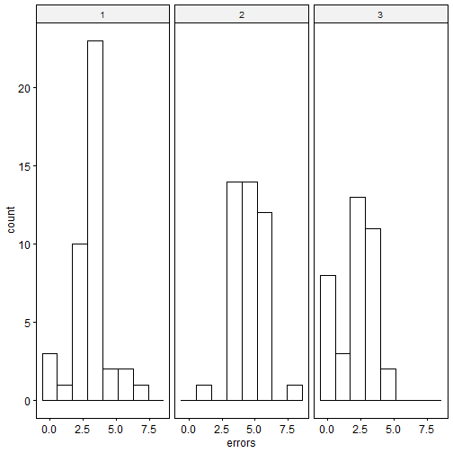
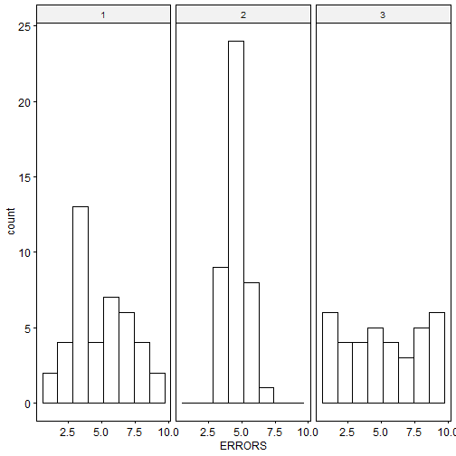

## Introduction
In today's session we will be working on a priori and post-hoc testing. We will initially look at a task where we can carry out a post-hoc analysis by performing multiple *t*-tests and correcting our *p*-values. As mentioned last week we have different packages and functions available to carry out an analysis of variance. This week we will be working with the following packages and functions.   
 

`library(haven) ### used to load SPSS .sav files, read_sav()`  
`library(tidyverse) ### for general purpose functions`   
`library(rstatix) ### used for our ANOVA, anova_test()`   
`library(ggpubr) ### used for graphs such as gghistogram()`
`library(gmodels) ### used for fit.contrast() to create contrasts`   

In this week's exercise we are only going to use one data file which is **epinex7.sav**. This file can be found on moodle. This is the same experiment as in task 1 of exercise on one-way anova using mice. This time, however, the dosages are 0.0 mg, 300 mg and 500 mg. Here, as well as the one-way ANOVA you carried out in the earlier, you are going to carry out Post Hoc and A Priori tests which can tell exactly which conditions are significantly different from each other. 


## Task 1.  
  Run a One-way ANOVA on the data in **epinex7.sav**. The experimenter wants to know which of the three conditions are different from one another, something the ANOVA cannot tell us directly. Use t-tests with the Bonferroni adjustment to find out. You should be able to complete this task using your knowledge of carrying out one-way anova and *t*-tests. You should also check for assumptions we did in previous weeks. We will not be including that below.


Q1) The results of the ANOVA are : *F*(___,_____)= _______, ________, _______    
Q2) What are the means, standard deviations and Ns for each DOSAGE condition?     
Q3) Is there a significant difference between DOSAGE conditions?      
Q4) What is the family of comparisons for this post hoc test?    
Q5) What is the familywise error rate for the post hoc test?     
Q6) What can you conclude from the *t*-tests (verbally, no numbers)?           


## Task 1: Solution


```r
library(haven) ### used to load SPSS .sav files, read_sav()
library(tidyverse) ### for general purpose functions
library(rstatix) ### used for our ANOVA, anova_test()
library(ggpubr) ### used for graphs such as gghistogram()

data <- read_sav("epinex7.sav")
data
```

```
## # A tibble: 121 x 3
##      SNO     DOSAGE ERRORS
##    <dbl>  <dbl+lbl>  <dbl>
##  1     1 1 [0.0 mg]      0
##  2     2 1 [0.0 mg]      3
##  3     3 1 [0.0 mg]      4
##  4     4 1 [0.0 mg]      2
##  5     5 1 [0.0 mg]      3
##  6     6 1 [0.0 mg]      3
##  7     7 1 [0.0 mg]      4
##  8     8 1 [0.0 mg]      0
##  9     9 1 [0.0 mg]      5
## 10    10 1 [0.0 mg]      4
## # ... with 111 more rows
```

```r
### always remember to set your variables as factors where necessary
data$DOSAGE <- as.factor(data$DOSAGE)

### get mean and sd for our DV grouped by dosage level
data %>% 
  group_by(DOSAGE) %>% 
  get_summary_stats(ERRORS, type = "mean_sd")
```

```
## # A tibble: 3 x 5
##   DOSAGE variable     n  mean    sd
##   <fct>  <chr>    <dbl> <dbl> <dbl>
## 1 1      ERRORS      42  3.14  1.52
## 2 2      ERRORS      42  4.81  1.25
## 3 3      ERRORS      37  4.11  1.43
```

```r
## anova time
# first describe the model
anova.model <- anova_test(
  data = data, 
  dv = ERRORS, 
  wid = SNO,  ## this is our participant id variable
  between = DOSAGE,
  type = 3,
  detailed = TRUE
)

# then get the anova table
get_anova_table(anova.model)
```

```
## ANOVA Table (type III tests)
## 
##        Effect      SSn     SSd DFn DFd       F        p p<.05   ges
## 1 (Intercept) 1948.601 233.187   1 118 986.055 3.92e-59     * 0.893
## 2      DOSAGE   58.780 233.187   2 118  14.872 1.74e-06     * 0.201
```

```r
# You can manually calculate the MSE by dividing
## SSd and DFd. Make sure you specify the second line 
## of your anova.model by typing [2,]
MSE <- anova.model[2,"SSd"]/(anova.model[2,"DFd"])
MSE
```

```
## [1] 1.976161
```

```r
## manually carrying out t-tests for post-hoc analysis
## we will need to compare all conditions
## this means in each t-test we will be excluding one condition


t_test(data, ERRORS ~ DOSAGE, 
       var.equal = TRUE, paired = FALSE,
       comparisons = list(c("1", "2"),
                          c("2", "3"),
                          c("1", "3")),
       p.adjust.method = "none")
```

```
## # A tibble: 3 x 10
##   .y.   group1 group2    n1    n2 statistic    df       p   p.adj p.adj.signif
## * <chr> <chr>  <chr>  <int> <int>     <dbl> <dbl>   <dbl>   <dbl> <chr>       
## 1 ERRO~ 1      2         42    42     -5.47    82 4.68e-7 4.68e-7 ****        
## 2 ERRO~ 2      3         42    37      2.32    77 2.3 e-2 2.3 e-2 *           
## 3 ERRO~ 1      3         42    37     -2.89    77 5   e-3 5   e-3 **
```

Q1) The results of the ANOVA are : F(___,_____)= _______, ________, _______   
**The ANOVA is significant, F(2,118) = 14.872, MSE = 1.976, p < .001.** 

Q2) What are the means, standard deviations and Ns for each DOSAGE condition?    
**For 0mg condition, M = 3.14, SD = 1.52, N = 42; for 300mg condition, M = 4.81, SD = 1.25, N = 42; for 500mg condition, M = 4.11, SD = 1.43, N = 37.**   

Q3) Is there a significant difference between DOSAGE conditions?   
**Yes, the ANOVA tells us that at least one condition must be significantly different from at least one other condition. But it doesn’t tell us which ones!**   

Q4) What is the family of comparisons for this post hoc test?
**There are three comparisons here: 0mg vs. 300mg, 0mg vs. 500mg, and 300mg vs. 500mg. **

Q5) What is the familywise error rate for the post hoc test? 
**The familywise error rate is 1 - (1 - .05)<sup>k</sup>, where k = the number of comparisons you do. With three comparisons, the error rate is .14**

Q6) What can you conclude from the tests (verbally, no numbers)?         
**The three t-tests show that the two drug conditions – 300mg and 500mg – are both significantly different from the 0mg control condition. The 300 and 500mg conditions are not significantly different from one another. Notice that the 300 and 500mg conditions would have been significantly different had we not applied the correction. You can replace "none" with "boneferroni" in the solution to see what happens** 


## Task 2: 
	Using the same data file as in task 1, carry out the ANOVA again but this time do a different post hoc test (Tukey’s Honestly Significant Difference test). 

Q1) Which conditions does Tukey’s HSD indicate as significantly different from one another?    
Q2) What is the family of comparisons for this post-hoc test?   
Q3) What is the familywise error rate for the post-hoc test?     
Q4) What can you conclude from the tests (verbally, no numbers)?    


## Task 2: Solution   


```r
## The ANOVA script is the same as above
## as we only changed our post-hoc analysis
## this time we will use Tukey's HSD

## tukey_hsd() can be used together with the aov()
## for even greater conveneience
## aov() is another option for carrying our our analysis of variance

library(haven) ### used to load SPSS .sav files, read_sav()
library(tidyverse) ### for general purpose functions
library(rstatix) ### used for our ANOVA, anova_test()
library(ggpubr) ### used for graphs such as gghistogram()

data <- read_sav("epinex7.sav")
data
```

```
## # A tibble: 121 x 3
##      SNO     DOSAGE ERRORS
##    <dbl>  <dbl+lbl>  <dbl>
##  1     1 1 [0.0 mg]      0
##  2     2 1 [0.0 mg]      3
##  3     3 1 [0.0 mg]      4
##  4     4 1 [0.0 mg]      2
##  5     5 1 [0.0 mg]      3
##  6     6 1 [0.0 mg]      3
##  7     7 1 [0.0 mg]      4
##  8     8 1 [0.0 mg]      0
##  9     9 1 [0.0 mg]      5
## 10    10 1 [0.0 mg]      4
## # ... with 111 more rows
```

```r
### always remember to set your variables as factors where necessary
data$DOSAGE <- as.factor(data$DOSAGE)


aov(ERRORS ~ DOSAGE, df2) %>% tukey_hsd()
```

```
## # A tibble: 3 x 9
##   term   group1 group2 null.value estimate conf.low conf.high       p.adj
## * <chr>  <chr>  <chr>       <dbl>    <dbl>    <dbl>     <dbl>       <dbl>
## 1 DOSAGE 1      2               0    1.67     0.939    2.39   0.000000902
## 2 DOSAGE 1      3               0    0.965    0.213    1.72   0.00801    
## 3 DOSAGE 2      3               0   -0.701   -1.45     0.0509 0.0731     
## # ... with 1 more variable: p.adj.signif <chr>
```


## The Study 

For this exercise we are going to look at an experiment involving mice given different levels of a drug to see if their memory (of how to get through a maze) is affected.  The data file that we are going to use for task 1 of this exercise is **epinex6.sav** (found in the MOODLE-SP500-COMPUTING-data files). This data file has three columns. **SNO**, **DOSAGE** and **ERRORS**. These columns represent the subject number (in this case mouse number), dosage level of a drug called Epinephrine and how many errors (wrong turns) each mouse made in a maze that they had learnt previously. The experimenter hypothesised that a small amount of the Epinephrine (300mg) would improve the mice’s memory and subsequent performance but a very large amount (1000mg) would impair their memory and performance would deteriorate. In the experiment there were three conditions. A control condition where mice were not given any Epinephrine (this condition is labelled “1” in the DOSAGE column), a condition where a different set of mice were given 300mg before being placed in the maze (labelled “2” in DOSAGE) and the final condition where the dosage was 1000mg (labelled “3” in DOSAGE). Each mouse was randomly allocated to one of these three conditions.   

Q1) Produce table of means, standard deviations, and N’s of the three conditions that the analysis compares.    
Q2) Produce the summary table of the Analysis of Variance.    
Q3) From the summary-table, what is the F-value and the p-value?     
Q4) Is there a significant difference between the dosage conditions?     
Q5) Has the experimenter’s hypothesis been supported? Why or Why not?      
Q6) From the histograms alone, describe the different effects of the drugs on each group.    
Q7) Calculate and report your MSE value?   
 


### Task 2
The investigator who carried out the experiment in task 1 using mice, replicated it this time using rats. Data for this replicated study can be found in the data file **epinex62.sav**. Open this file and carry out the same analysis as task 1 (Histograms, ANOVA and descriptives) but this time using the new data. Note that the variable names are now in uppercase letters. This is actually not recommended and you should always use lowercase letters. 

Q1) Produce means, standard deviations, and N’s of the three conditions that the analysis compares.    
Q2) Produce a summary table of the Analysis of Variance.    
Q3) From the summary-table, what is the F-value and the p-value?    
Q4) Is there a significant difference between the DOSAGE conditions?     
Q5) Has the experimenter’s hypothesis been supported? Why or Why not?     
Q6) From the histograms alone, describe the different effect of the drugs on each group.    
Q7) Calculate and report your MSE value?    


## Task 1 Solution


```r
library(haven)
library(tidyverse)
library(rstatix)
library(ggpubr)

df <- read_sav("epinex6.sav")
df
```

```
## # A tibble: 121 x 3
##      sno     dosage errors
##    <dbl>  <dbl+lbl>  <dbl>
##  1     1 1 [0.0 mg]      0
##  2     2 1 [0.0 mg]      3
##  3     3 1 [0.0 mg]      4
##  4     4 1 [0.0 mg]      2
##  5     5 1 [0.0 mg]      3
##  6     6 1 [0.0 mg]      3
##  7     7 1 [0.0 mg]      4
##  8     8 1 [0.0 mg]      0
##  9     9 1 [0.0 mg]      5
## 10    10 1 [0.0 mg]      4
## # ... with 111 more rows
```

```r
### always remember to set your variables as factors where necessary
df$dosage <- as.factor(df$dosage)

### Question 1
### get mean and sd for our DV grouped by dosage level
df %>% 
  group_by(dosage) %>% 
  get_summary_stats(errors, type = "mean_sd")
```

```
## # A tibble: 3 x 5
##   dosage variable     n  mean    sd
##   <fct>  <chr>    <dbl> <dbl> <dbl>
## 1 1      errors      42  3.14  1.52
## 2 2      errors      42  4.81  1.25
## 3 3      errors      37  2.11  1.50
```

```r
### get histograms

gghistogram(df, x = "errors", facet.by = "dosage", bins = 8)
```



```r
## anova time
# first describe the model
anova.model <- anova_test(
  data = df, 
  dv = errors, 
  wid = sno,  ## this is our participant id variable
  between = dosage,
  type = 3,
  detailed = TRUE
)
```

```
## Coefficient covariances computed by hccm()
```

```r
# Question 2
# then get the anova table
get_anova_table(anova.model)
```

```
## ANOVA Table (type III tests)
## 
##        Effect      SSn     SSd DFn DFd       F        p p<.05   ges
## 1 (Intercept) 1355.911 241.187   1 118 663.376 2.90e-50     * 0.849
## 2      dosage  147.970 241.187   2 118  36.197 5.51e-13     * 0.380
```

```r
## You can manually calculate the MSE by dividing
## SSd and DFd. Make sure you specify the second line 
## of your anova.model by typing [2,]
MSE <- anova.model[2,"SSd"]/(anova.model[2,"DFd"])
MSE
```

```
## [1] 2.043958
```

Q1 and Q2 look at code above      
Q3) *F* = 36.197, *p* = 5.51 &times; 10<sup>-13</sup>     
Q4) Yes         
Q5) No, while there are differences amongst the cell means, the pattern is inconsistent with the experimenter's hypotheses. Performance appears to have declined (i.e. more errors) in the 300mg condition and improved (i.e. fewer errors) in the 1000mg condition. However, follow-up analyses are needed to discern if these changes differ significantly from the control condition.        
Q6) 300mg seem to be normally distributed with 0mg and 1000mg looking more positively skewed. Mean number of errors is lowest in the 1000mg condition and highest in the 300mg condition.     


## Task 2 Solution


```r
library(haven)
library(tidyverse)
library(rstatix)
library(ggpubr)

df2 <- read_sav("epinex62.sav")
df2
```

```
## # A tibble: 121 x 3
##      SNO     DOSAGE ERRORS
##    <dbl>  <dbl+lbl>  <dbl>
##  1     1 1 [0.0 mg]      9
##  2     2 1 [0.0 mg]      3
##  3     3 1 [0.0 mg]      1
##  4     4 1 [0.0 mg]      7
##  5     5 1 [0.0 mg]      3
##  6     6 1 [0.0 mg]      3
##  7     7 1 [0.0 mg]      7
##  8     8 1 [0.0 mg]      7
##  9     9 1 [0.0 mg]      5
## 10    10 1 [0.0 mg]      4
## # ... with 111 more rows
```

```r
### always remember to set your variables as factors where necessary
df2$DOSAGE <- as.factor(df2$DOSAGE)


### Question 1
### get mean and sd for our DV grouped by dosage level
df2 %>% 
  group_by(DOSAGE) %>% 
  get_summary_stats(ERRORS, type = "mean_sd")
```

```
## # A tibble: 3 x 5
##   DOSAGE variable     n  mean    sd
##   <fct>  <chr>    <dbl> <dbl> <dbl>
## 1 1      ERRORS      42  5    2.20 
## 2 2      ERRORS      42  5    0.765
## 3 3      ERRORS      37  5.16 2.89
```

```r
### get histograms

gghistogram(df2, x = "ERRORS", facet.by = "DOSAGE", bins = 8)
```



```r
## anova time
# first describe the model
anova.model2 <- anova_test(
  data = df2, 
  dv = ERRORS, 
  wid = SNO,  ## this is our participant id variable
  between = DOSAGE,
  type = 3,
  detailed = TRUE
)
```

```
## Coefficient covariances computed by hccm()
```

```r
### Question 2
# then get the anova table
get_anova_table(anova.model2)
```

```
## ANOVA Table (type III tests)
## 
##        Effect      SSn     SSd DFn DFd       F        p p<.05   ges
## 1 (Intercept) 3079.749 523.027   1 118 694.821 2.82e-51     * 0.855
## 2      DOSAGE    0.675 523.027   2 118   0.076 9.27e-01       0.001
```

```r
## You can manually calculate the MSE by dividing
## SSd and DFd. Make sure you specify the second line 
## of your anova.model by typing [2,]
MSE <- anova.model2[2,"SSd"]/(anova.model2[2,"DFd"])
MSE
```

```
## [1] 4.432432
```

Q1 and Q2 look at code above    

Q3) *F* = 0.076, *p* = 0.927       
Q4) No     
Q5) No, there are no significant mean differences, which is inconsistent with the experimenter's hypotheses.        
Q6) 300mg look to be normally distributed, with 0mg positively skewed. 1000mg seems to be be uniform or even better a bimodal distribution.     

